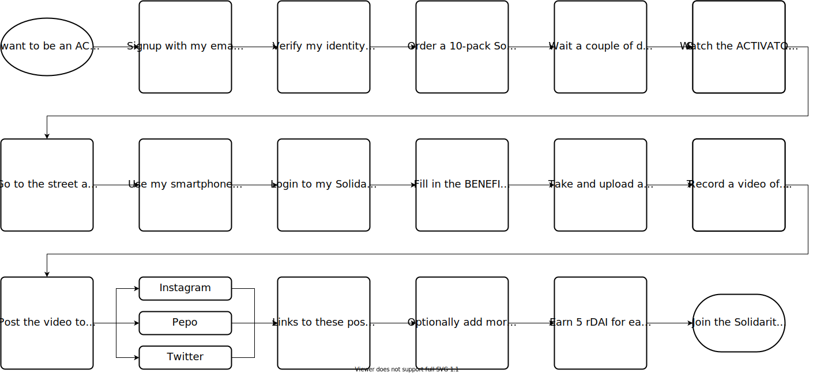
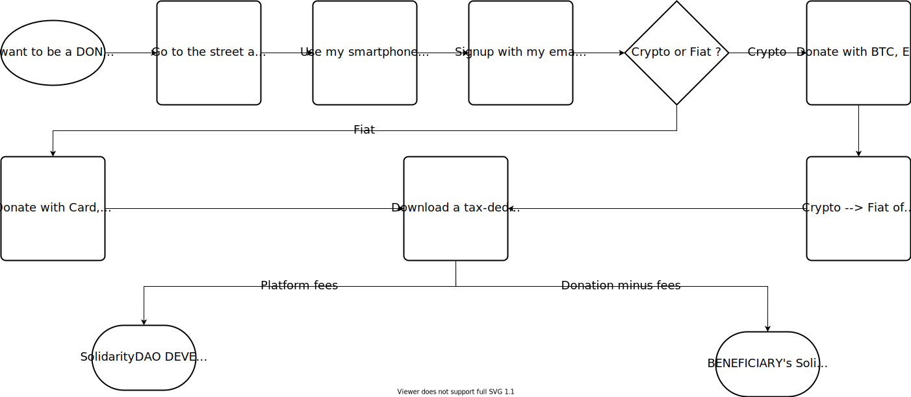
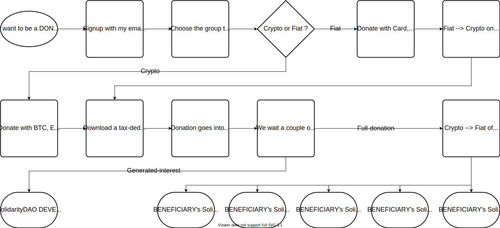

# SolidarityCard

Including the homeless and undocumented in the cashless revolution.

## Motivation

Around the globe, more and more people are transitioning to a cashless existence. China and Scandinavia are places where people rarely use cash anymore. This presents additional challenges to those who find themselves on the edges of society. Full participation in the cashless economy requires access to government-issued documents, bank accounts, and mobile computation. But, as we all know, the most vulnerable members of our society, homeless and refugees, are excluded through these inhumane barriers to entry. And now that the rest of us are making the transition, will we walk past them, indifferent to their plight, and unable to spare a dime? Will we transcend into the decentralized cloud and leave them all behind?

We would like to propose a radical experiment to solve this issue.

## Donation

1. A donor scans a card
2. He makes a donation (fiat or crypto)

## Onboarding

1. Members request new cards
2. He/she gives one to a beneficiary

See the [detailed process here](https://docs.google.com/presentation/d/12o_Hm2-iUQrpSLjYbNULFY7OnBbEp4UJzf6qTp5JBX0/edit#slide=id.g7130c576f9_0_421).

## MVP

The MVP (v0.1) will include the following items: 

* A simple donation page ([preview](https://juliens-blank-site-20b4d7.webflow.io/))
* Card activation UI

## Resources

* [Gitcoin channel](https://chat.gitcoin.co/hackathons/channels/solidaritycard)

* [Brainstorming](https://www.notion.so/SolidarityCard-48b71df290e04973bf61c88abd381084)

* [Presentation](https://docs.google.com/presentation/d/12o_Hm2-iUQrpSLjYbNULFY7OnBbEp4UJzf6qTp5JBX0/edit?usp=sharing)

* [Design prototypes](https://www.figma.com/file/rM6NfLVrjyk7Y7VCCkGJEo/SolidarityCard?node-id=109%3A2)

* [Donation page preview](https://juliens-blank-site-20b4d7.webflow.io/)

## Community-powered KYC

## Donate to a person (instant)

## Donate to a group (deferred)

